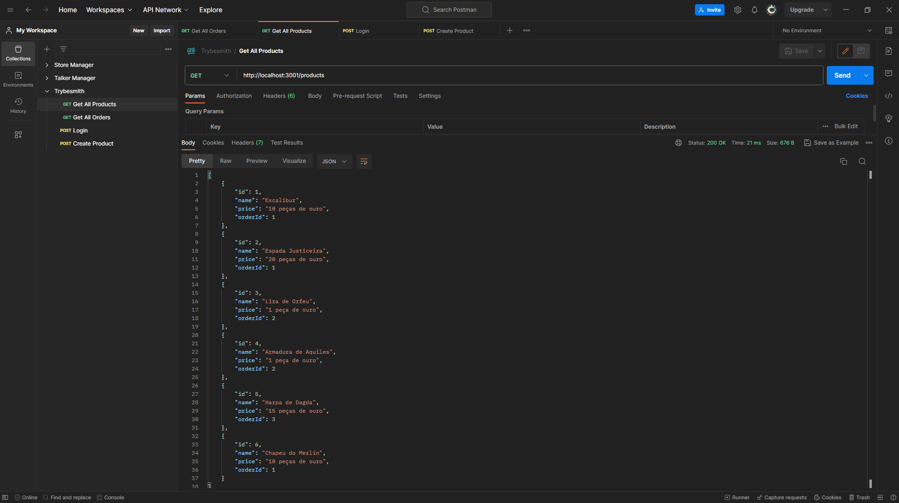

# Trybesmith



# Índice

* [Título e Imagens Home](#trybesmith)
* [tecnologias utilizadas](#tecnologias-utilizadas)
* [Descrição do projeto](#descrição-do-projeto)
* [Status do Projeto](#status-do-projeto)
* [Funcionalidade do projeto](#🔨-funcionalidade-do-projeto)
* [Acesso ao Projeto](#acesso-ao-projeto)
* [Rotas](#rotas)

# Tecnologias utilizadas


# Descrição do Projeto

O projeto "Trybesmith" é parte do currículo da formação de Desenvolvedor Web da [Trybe](https://www.betrybe.com/). Nesse projeto, os alunos têm a oportunidade de aplicar seus conhecimentos para Criar uma API Rest Full com Typescript, MySQL, JWT e docker. 

# Status do Projeto

> 💹 Alpha 💹

# 🔨 Funcionalidade do projeto

- Lista todos os Produtos
- Lista todas ordens
- Fazer Login
- Criar novos Produtos

# Acesso ao projeto

Para acessar e executar este projeto, siga os passos abaixo:

1. Certifique-se de ter o Docker instalados em sua máquina.

2. Clone o Projeto

```bash
git clone https://github.com/EversonDias/API_Rest_Full_Trybesmith_with_TypeScript_Docker_JTW_and_MySQL.git Trybesmith
```

3. Entre no projeto

```bash
cd Trybesmith
```

5. inicie o projeto

```bash
docker-compose up -d
```

# Rotas

<details>
<summary><strong>Get All Products</strong></summary>

method ```GET```

Rota

```bash
http://localhost:3001/products
```

</details>

<details>
<summary><strong>Get All Orders</strong></summary>

method ```GET```

Rota

```bash
http://localhost:3001/orders
```

</details>

<details>
<summary><strong>Logins</strong></summary>

method ```POST```

Rota

```bash
http://localhost:3001/login
```

Corpo da Requisição

```bash
{
  "username": "Hagar",
  "password": "terrível"
}
```

</details>

<details>
<summary><strong>Create Product</strong></summary>

method ```POST```

Rota

```bash
http://localhost:3001/products
```

Corpo da Requisição

```bash
{
  "name": "Chapeu do Merlin",
  "price": "10 peças de ouro",
  "orderId": 1
}
```

</details>
